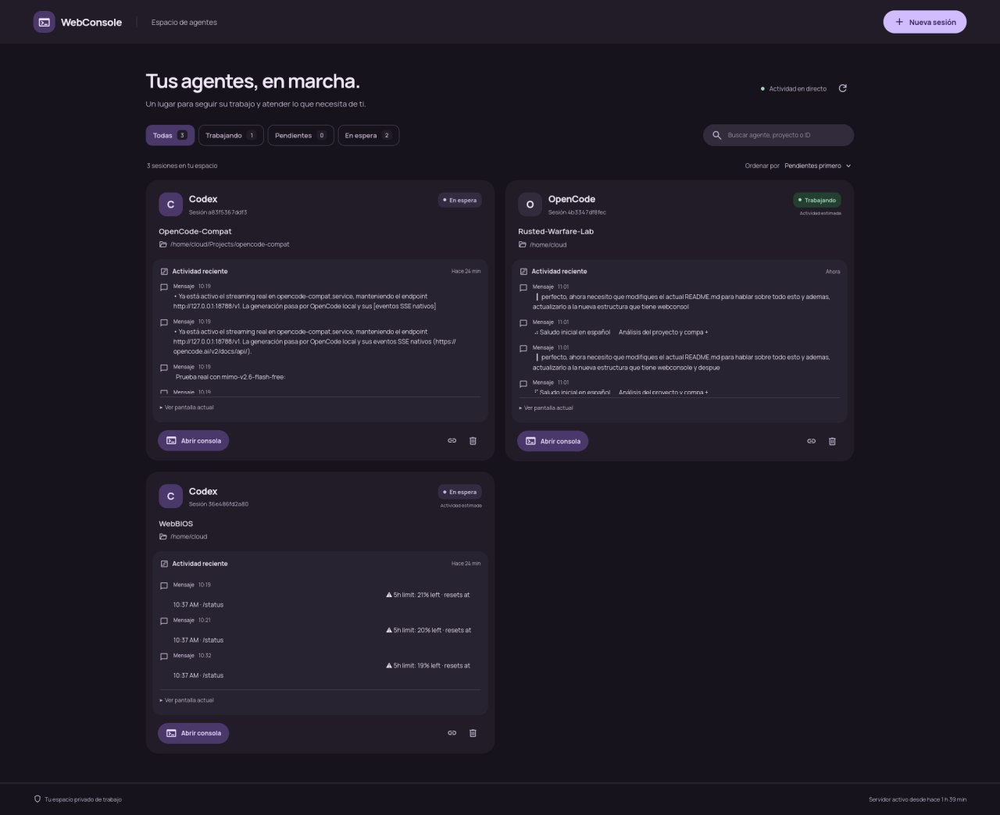
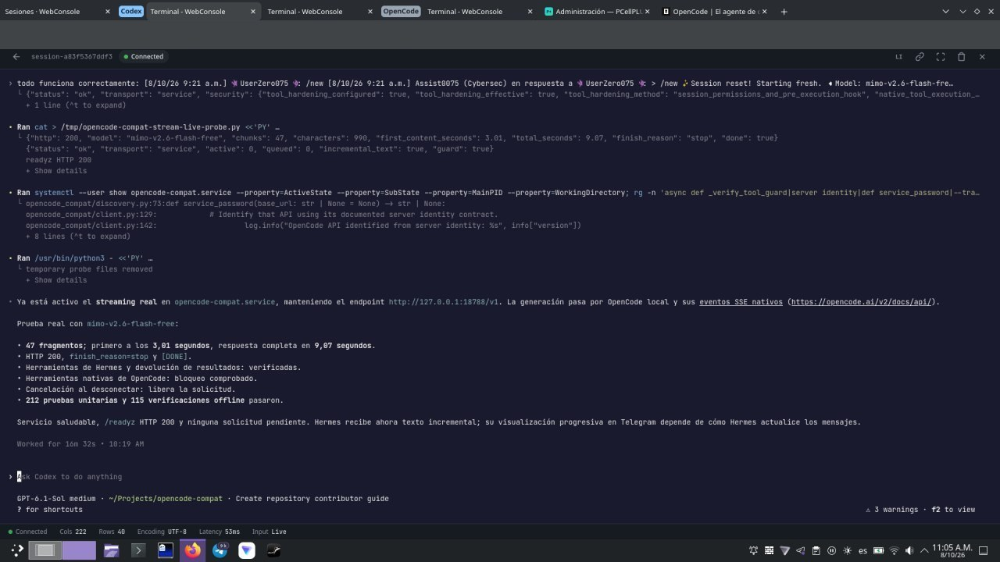
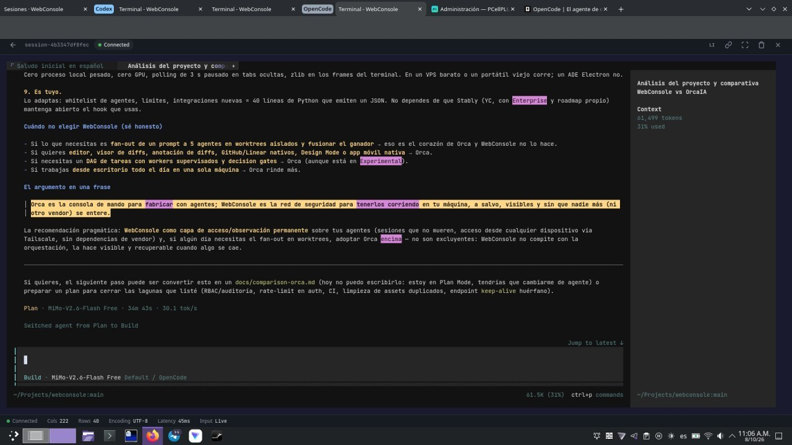

# WebConsole

**Terminal web privada para Tailscale**, con xterm.js, sesiones **tmux persistentes** y un
**espacio de agentes** para seguir en un solo lugar a todos los agentes AI que estás
corriendo.

Se instala en un VPS, en una NAS o en tu propia máquina, se expone con Tailscale Serve y
se usa desde **cualquier navegador** (escritorio, tablet o móvil). Sin app que instalar en
el cliente, sin cuenta, sin telemetría, sin dependencias de terceros.

| Requisitos | |
| --- | --- |
| Sistema | Linux |
| Python | 3.x |
| tmux | **3.0 o superior** (`sudo apt install tmux` en Debian/Ubuntu) |
| Dependencias Python | `flask`, `flask-sock`, `websockets` (3 en total) |

---

## Contenido

1. [Capturas](#capturas)
2. [Qué hace](#qué-hace)
3. [Características](#características)
4. [Fortalezas del proyecto](#fortalezas-del-proyecto)
5. [WebConsole vs Orca](#webconsole-vs-orca)
6. [Instalación local](#instalación-local)
7. [Despliegue como servicio](#despliegue-como-servicio-user-service)
8. [Estructura del proyecto](#estructura-del-proyecto)
9. [Configuración](#configuración)
10. [Pruebas](#pruebas)
11. [Limitaciones conocidas](#limitaciones-conocidas)

---

## Capturas

### Espacio de agentes (dashboard)



*Cada tarjeta muestra el agente, el ID de sesión, la tarea, el directorio de trabajo, la
actividad reciente, los avisos pendientes y la pantalla actual. Con filtros por estado,
búsqueda y ordenación "pendientes primero".*

### Consola con un agente Codex en marcha



*Terminal real sobre tmux: herramientas a pantalla completa (Codex, OpenCode, htop, vim…),
barra de estado con conexión, tamaño, codificación, latencia y modo de entrada.*

### Sesión de OpenCode con seguimiento en directo



*Misma terminal, otro agente. El dashboard y la consola se ven a la vez en pestañas
diferentes: cada pestaña recibe la misma salida.*

> Las capturas están incluidas en el repositorio (`docs/images/`) para que puedas ver el
> programa **antes de instalar nada**.

---

## Qué hace

WebConsole resuelve tres problemas concretos de trabajar con agentes AI en un servidor:

1. **Las sesiones se mueren.** Cerrar la pestaña, perder el WiFi o suspender el portátil
   no debería matar un agente que lleva 40 minutos trabajando. Aquí el proceso vive en
   **tmux**, no en el navegador: recargas, te desconectas o reinicias el servidor HTTP y
   al reabrir la misma URL tienes **el mismo proceso, con el mismo PID y la misma
   pantalla**.
2. **No ves qué están haciendo.** El **espacio de agentes** te muestra, cada pestaña
   abierta, qué agentes corren, en qué tarea, qué han dicho recientemente, qué necesita
   tu atención (permisos pendientes) y la pantalla actual — sin leer sus bases de datos ni
   inyectar nada en su terminal.
3. **El acceso es incómodo.** Nada de SSH desde el móvil, VS Code Remote o port-forwarding
   manual: una URL en tu tailnet y ya está. Válida desde cualquier dispositivo y cualquier
   navegador.

**Stack:** Python 3 + Flask → WebSocket → tmux (socket y configuración propios) →
xterm.js 5.31 en el navegador. Unidades de servicio systemd con `KillMode=process` para
que reiniciar el servidor web **no** toque los agentes.

---

## Características

### Sesiones que no mueren

El shell y las herramientas corren dentro de tmux, independientemente de las conexiones
del navegador. Refrescar, cerrar una pestaña, cambiar de pestaña, perder conectividad o
suspender el navegador **solo** desconecta su cliente de terminal. Reabrir la misma URL de
sesión vuelve a engancharse al mismo proceso y redibuja la pantalla actual, incluidas
herramientas a pantalla completa como Codex. Varias pestañas reciben la misma salida.
**No hay expiración por inactividad.**

Las URLs y los metadatos de sesión se guardan en `app/sessions/` con permisos privados
(directorio `0700`, JSON `0600`, escritura atómica). Un shell terminado **sigue
terminado**: la aplicación nunca lo reemplaza en silencio por uno nuevo. Borra las
sesiones desde el dashboard cuando termines. Los límites por defecto son **32 sesiones**
y **4 conexiones de navegador simultáneas** por sesión.

La pantalla de tmux y su scrollback acotado se quedan en el servidor. Un navegador nuevo
recibe la pantalla actual; el scrollback antiguo se consulta con el modo copia de tmux
desde un attach local, no se descarga entero en cada reconexión.

**Supervivencia a reinicios:** la unidad systemd incluida usa `KillMode=process`, así que
reiniciar el servidor HTTP deja vivo al servidor tmux y a todas las herramientas, y la
metadata restaura las mismas URLs. Un reinicio de la máquina, un borrado explícito de
sesión, la terminación de tmux o una política de cierre de sesión del sistema sí pueden
terminar las herramientas: configura el *lingering* de servicios de usuario con tu
administrador si los servicios deben sobrevivir al logout.

> **Migración desde la versión anterior con PTY:** los shells existentes no se pueden
> trasladar a tmux. Termina o guarda el trabajo de esas sesiones antes de reiniciar el
> servidor antiguo y crea sesiones nuevas después de la actualización. Las URLs de la
> versión anterior solo vivían en memoria y no se pueden restaurar.

### Espacio de agentes

La portada muestra el ID de sesión, el proceso del agente o la herramienta, el nombre de
la tarea, el directorio de trabajo, los mensajes y la actividad de herramientas recientes,
los avisos pendientes y la pantalla actual del terminal. Incluye **búsqueda**, **filtros
de estado** (todas / trabajando / pendientes / en espera) y **ordenación** con los
pendientes primero. Las actualizaciones conservan el foco del teclado, los previews
expandidos y el feed que estás leyendo. Las pestañas ocultas pausan el sondeo del
dashboard; el servidor sigue monitorizando.

El monitor muestrea tmux y los descendientes del proceso del pane **cada 2 segundos**.
Reconoce **Codex, OpenCode, Hermes, Claude Code y Aider**, incluidos los wrappers de
intérprete habituales; cualquier otro proceso aparece como herramienta. No lee bases de
datos de agentes ni inyecta entrada en el terminal. Las previsualizaciones de pantalla
están acotadas y cada sesión conserva como máximo **60 entradas de actividad** (16 por
respuesta). Mensajes muy rápidos que aparecen y desaparecen entre muestreos pueden no
capturarse.

**Precisión del estado:** la presencia del proceso se *observa*. Los estados
trabajando/en espera derivados del CPU o de cambios de pantalla se marcan como
**«Actividad estimada»**. Un proceso silencioso puede estar esperando a una API, a una
entrada del usuario o a una herramienta larga: **el silencio nunca se interpreta como
tarea completada**. Los avisos de permiso en la pantalla visible son estimaciones y no
incluyen scrollback antiguo. Los eventos nativos del agente aportan estado confirmado y
avisos de finalización. La desaparición de un proceso de herramienta genera un aviso de
*proceso terminado*, distinto de un turno de agente completado. **Ver o marcar un aviso de
permiso nunca aprueba el comando.**

Los avisos pendientes y sus acuses se guardan en los metadatos privados de la sesión. Los
acuses incluyen una huella (*fingerprint*), de modo que una pestaña obsoleta no puede borrar
un aviso nuevo. La lista de actividad vive en memoria: tras un reinicio del servidor parte
de la pantalla actual, mientras los avisos guardados persisten.

### Lanzador de agentes e integraciones nativas

Usa **Nueva sesión** para elegir un agente, dar nombre a la tarea y fijar su directorio de
trabajo. **Consola · detección automática** abre Bash y observa lo que sea que ejecutes.
Cuando un agente lanzado por el selector termina, la sesión vuelve a Bash en lugar de
reiniciar ese agente. El lanzador carga el entorno de tu shell de *login* (incluidas las
rutas de NVM) y reaplica el directorio de trabajo elegido.

| Agente | Mecanismo |
| --- | --- |
| **Codex** | El *completion hook* se inyecta como override de CLI (`-c notify=…`) **sin modificar** `~/.codex/config.toml`. Cubre el fin de turno; los permisos y la actividad se observan desde la terminal. |
| **OpenCode** | Plugin local (`integrations/opencode.mjs`) añadido mediante `OPENCODE_CONFIG_CONTENT`, fusionado con tu configuración existente. Emite permisos, cambios de estado, mensajes y ciclo de vida de herramientas; los mensajes en *stream* se coalescen y actualizan en el sitio. |
| **Hermes** | CLI arrancado con observación de pantalla y proceso. Para eventos de herramienta y turno confirmados, añade estos hooks a tu perfil de Hermes con las rutas absolutas de tu instalación. El consentimiento inicial de hooks de Hermes sigue siendo suyo: WebConsole no lo acepta por ti. |
| **Claude Code, Aider** | Detección por nombre de proceso (sin integración de eventos). |
| **Cualquier herramienta** | Cualquier ejecutable puede informar eventos sin peticiones de red, heredando `WEBCONSOLE_EVENT_DIR`. |

Ningún lanzador habilita aprobaciones automáticas.

```yaml
# integraciones de Hermes — ajusta las rutas a tu instalación
hooks:
  pre_llm_call:
    - command: "/ruta/a/webconsole/.venv/bin/python /ruta/a/webconsole/integrations/hermes_event.py pre_llm_call"
  pre_tool_call:
    - command: "/ruta/a/webconsole/.venv/bin/python /ruta/a/webconsole/integrations/hermes_event.py pre_tool_call"
  post_tool_call:
    - command: "/ruta/a/webconsole/.venv/bin/python /ruta/a/webconsole/integrations/hermes_event.py post_tool_call"
  on_session_end:
    - command: "/ruta/a/webconsole/.venv/bin/python /ruta/a/webconsole/integrations/hermes_event.py on_session_end"
```

Cualquier otra herramienta puede notificar por su cuenta, sin red ni credenciales:

```bash
.venv/bin/python app/agent_event.py --type completed --agent hermes --message 'La tarea terminó'
```

Los ficheros de evento son privados, están limitados a **128 eventos pendientes** por
sesión y los consume el monitor. Los hooks **no** emiten directivas de permiso y **nunca**
bloquean esperando respuestas de red.

> En las sesiones creadas desde el selector, `WEBCONSOLE_EVENT_DIR` se hereda
> automáticamente. Para agentes lanzados a mano, abre una sesión nueva después de la
> actualización para que reciban la variable.

### Terminal

- **xterm.js 5.31** con *addons* **Fit** (ajuste automático) y **WebLinks** (URLs
  clicables), scrollback de 3000 líneas y tema oscuro.
- **Compresión zlib**: los frames del servidor se envían comprimidos cuando superan los
  192 bytes y el cliente los descomprime con pako.
- **Modo de entrada Local / Live (`Ctrl+B`)**: en *Local* la línea se edita y se dibuja
  localmente (Backspace, `Ctrl+A/E/U/W`, flechas, Delete) y solo se envía al terminal al
  pulsar Enter — escrito sobre enlaces débiles o desde el móvil. En *Live* cada tecla va
  directamente al TUI. La preferencia se guarda en `localStorage`.
- **Sugerencias al estilo Warp**: historial de comandos de la pestaña (máx. 120,
  `sessionStorage`) y **autocompletado de rutas** (`cd`, `ls`, `cat`, `vim`, `nano`,
  `code`, `open`…) con debounce y control de carreras. Navegación con ↑↓ y Tab.
- **Conexión robusta**: *heartbeat* `ping/pong` cada 25 s con latencia en la barra de
  estado, detección de socket estancado a 75 s, reconexión exponencial con *jitter* (máx.
  30 s) y reanudación al volver la pestaña a primer plano u `online`.
- **Multi-pestaña** hasta 4 clientes por sesión con salida idéntica, fullscreen, copiar
  enlace, Ctrl+L y confirmación antes de matar una sesión.
- El historial de comandos solo vive en el `sessionStorage` de la pestaña.

### Seguridad

Este es un servicio de terminal **single-user**. Cualquiera con acceso al dashboard puede
crear shells, ver los enlaces de sesión y borrar sesiones, con los permisos de SO de la
cuenta de servicio: usa una cuenta desprivilegiada y dedicada. **Tailscale solo no es
aislamiento individual de sesiones.**

- El bind por defecto es `127.0.0.1`; el acceso se restringe con Tailscale Serve (HTTPS) y
  las ACL de Tailscale.
- El *attach* por WebSocket exige un **token de sesión válido** (comparación en tiempo
  constante) y un **Origin** coincidente.
- Las mutaciones de la API exigen una **cabecera personalizada** (`X-WebConsole: 1`) y
  rechazan orígenes ajenos: protección CSRF sin tokens que guardar.
- Cabeceras de respuesta: `Referrer-Policy: no-referrer`, `X-Content-Type-Options:
  nosniff`, `X-Frame-Options: DENY`, CSP `frame-ancestors 'none'`, `Cache-Control:
  no-store` fuera de `/static/`.
- Tamaños acotados: peticiones y frames de 64 KiB, líneas de completado de 8192, títulos
  de 100, columnas 20–500, filas 5–200, IDs de sesión por *regex* y **whitelist** de
  agentes lanzadores.
- Todo el contenido generado por los agentes se inserta con `textContent` (sin XSS) y los
  ficheros de sesión/eventos son `0600` en un directorio `0700`.
- El shell hijo **no** recibe `WEBCONSOLE_PASSWORD` ni `SECRET_KEY`.
- La unidad systemd incluida endurece el servicio: `UMask=0077`, `NoNewPrivileges`,
  `PrivateTmp`, `ProtectSystem=full`, `RestrictSUIDSGID`, `TasksMax=512`.

**Autenticación opcional:** con `WEBCONSOLE_PASSWORD` en el entorno del servicio se exige
HTTP Basic (cualquier usuario, la contraseña configurada) y la sesión pasa a una cookie
firmada `HttpOnly` + `SameSite=Strict`. Usa **HTTPS**; HTTP Basic sobre HTTP claro no está
cifrado. Fija un `SECRET_KEY` estable y aleatorio y `COOKIE_SECURE=1` con HTTPS, y rota
también `SECRET_KEY` al revocar cookies existentes. Mantén `.env` privado (`chmod 600`).

Los enlaces de sesión son **credenciales tipo bearer**: no los compartas ni registres las
URL completas. Si usas un proxy inverso que no conserva `Host`, define
`PUBLIC_ORIGIN=https://tu-dispositivo.tu-tailnet.ts.net`. No expongas esta terminal en
público sin una revisión previa de autenticación y control de acceso.

---

## Fortalezas del proyecto

- **Semántica de sesión de nivel SO.** El proceso pertenece al servidor, no al navegador.
  Está implementado *y testeado*: reinicio completo del servidor HTTP → mismo PID de shell,
  mismas URLs, misma pantalla.
- **Honestidad sobre sus propios límites.** El estado se separa en `event` (confirmado) /
  `estimated` (CPU o pantalla) / `process` (presencia), y el documento dice explícitamente
  que el silencio no es completado y que un aviso en pantalla no es un permiso aprobado.
  Pocos proyectos describen con tanto detalle lo que **no** saben.
- **Observación sin invasión.** Lee `/proc` y la pantalla de tmux; no lee bases de datos de
  agentes ni inyecta teclado. Y los hooks **nunca** bloquean: la observabilidad no puede
  impedir que un agente termine su *hook*.
- **Superficie mínima y auditable.** ~2.800 líneas propias, 3 dependencias, sin build step
  ni framework JS. Se lee completo en una tarde — incluida toda la lógica de seguridad.
- **Modelo de amenaza explícito.** Una cabecera + Origin controlan toda la mutación; tokens
  bearer con comparación constante; entorno hijo saneado; ficheros con permisos privados.
- **UX que respeta tu atención.** Actualización *in-place* sin reconstruir el DOM (foco,
  `<details>` y scroll del feed preservados), polling pausado en pestañas ocultas, acuses
  con huella anti-pestaña-obsoleta y apertura de pestañas sin bloqueador de pop-ups.

---

## WebConsole vs Orca

[Orca](https://www.onorca.dev/) (Stably AI, open source MIT, ~87.7k estrellas en octubre
de 2026) es un **ADE** (*Agent Development Environment*): una app de escritorio (Electron,
macOS/Windows/Linux + apps móviles) que ejecuta agentes CLI **en paralelo en git worktrees
aislados**, con editor Monaco, visor y anotación de diffs, GitHub/Linear nativos, browser
embebido con *Design Mode*, SSH/Cloud VMs y una capa de orquestación experimental
(Run → Tasks con DAG → Dispatches → workers supervisados → *decision gates*).

No son exactamente el mismo producto: **Orca es la consola de mando para *fabricar* con
agentes; WebConsole es la red de seguridad para *tenerlos corriendo*** en tu máquina, a
salvo, visibles y sin que un tercer vendor se entere.

| | **WebConsole** | **Orca** |
| --- | --- | --- |
| Tipo | Terminal web + observación | ADE / orquestador completo |
| Cliente | Cualquier navegador, desde cualquier dispositivo | App Electron + apps móviles |
| Peso en el cliente | 0 (nada que instalar) | Runtime Electron de cientos de MB |
| Persistencia de sesión | tmux a nivel de SO: sobrevive a refresco, red caída, portátil suspendido **y** reinicio del servidor web | Restauración de sesión a nivel de aplicación |
| Orquestación (fan-out, worktrees, DAG) | No — observa y expone, no pilota | **Sí**, es su núcleo |
| Editor, diffs, GitHub/Linear, browser | No | Sí |
| Agentes | Cualquiera que corra en terminal; eventos nativos de Codex, OpenCode y Hermes | ~30+ agentes con integración de primera clase |
| Telemetría | **Ninguna**, todo local en `app/sessions/*.json` | Anónima a PostHog (EE. UU.), con opt-out |
| Cuentas / nube de terceros | Ninguna | Sin cuenta, pero con infra de emparejamiento móvil y relay |
| Superficie auditable | ~2.800 líneas, 3 dependencias, 0 build | 13.000+ commits, toolchain Node/pnpm/Electron |
| Instalación en el servidor | `systemctl --user enable --now webconsole.service` | `orca serve` o app de escritorio |

**Cuándo elegir WebConsole**

- Necesitas que los agentes **sobrevivan a todo** en un servidor siempre encendido y
  reengancharte desde donde estés (móvil, tablet, máquina prestada) sin instalar nada.
- Quieres **supervisar sin cambiar tu flujo**: seguir agentes que ya lanzas a mano, sin
  adoptar un modelo de Runs/Tasks/Dispatch ni migrar tu configuración.
- Tu criterio es **auditar de verdad** lo que toca tus datos: 3 dependencias, cero
  telemetría, cero cuenta, cero build.
- Quieres **predictibilidad operativa**: una unidad systemd, sin release diario que te
  cambie el comportamiento de una feature experimental.

**Cuándo elegir Orca (o combinarlos)**

- Si lo que quieres es **lanzar un mismo prompt a 5 agentes en worktrees aislados y
  fusionar el ganador**, o necesitas **editor, visor/anotación de diffs, GitHub y Linear
  nativos, *Design Mode* o app móvil nativa**: eso es el corazón de Orca y WebConsole no
  lo hace.
- Si trabajas **todo el día desde un solo escritorio**, Orca rinde más.
- **No son excluyentes:** WebConsole puede vivir debajo como capa de acceso y
  observación permanente (sesiones que no mueren, acceso desde cualquier dispositivo vía
  Tailscale, sin dependencias de vendor), y Orca adoptarse encima cuando necesites el
  fan-out en worktrees.

---

## Instalación local

```bash
git clone https://github.com/UserZero075/webconsole.git
cd webconsole

python3 -m venv .venv
. .venv/bin/activate
pip install -r requirements.txt
python app/server.py
```

Abre `http://127.0.0.1:3030/`. La dirección de bind por defecto es *loopback*; usa
Tailscale Serve para HTTPS y restringe el acceso con las ACL de Tailscale.

Para ejecutarlo directamente, exporta las variables de entorno antes de arrancar Python:
el fichero `.env` lo carga la unidad de systemd suministrada, **no** Python.

---

## Despliegue como servicio (user service)

Instala [deploy/webconsole.service](deploy/webconsole.service) como
`~/.config/systemd/user/webconsole.service` y ejecuta:

```bash
systemctl --user daemon-reload
systemctl --user enable --now webconsole.service
```

La unidad incluida usa `KillMode=process`: reiniciar el servidor HTTP deja corriendo al
servidor tmux y a las herramientas, y su socket vive en el directorio de estado persistente
(fuera del directorio temporal privado de systemd). **Conserva este ajuste** si adaptas la
unidad: la limpieza por *control group* que hace systemd por defecto mataría las
herramientas durante un reinicio.

---

## Estructura del proyecto

```text
webconsole/
├── app/
│   ├── server.py            # Servidor Flask: rutas, WebSocket, seguridad, completado (609 líneas)
│   ├── telemetry.py          # Monitor: muestreo de tmux//proc cada 2 s + ingestión de eventos (285)
│   ├── agent_event.py        # Emisor CLI/genérico de eventos hacia el monitor (58)
│   ├── session_shell.py      # Arranque por sesión: entorno de login, launcher del agente, env saneada (40)
│   ├── pty_exec.py           # Cliente de terminal: TIOCSCTTY + exec de tmux attach (8)
│   ├── tmux.conf             # Configuración de tmux aislada de la del usuario (7)
│   └── sessions/             # Metadata privada por sesión (0600) — ignorada por git
├── integrations/
│   ├── opencode.mjs          # Plugin de OpenCode: permisos, estado, mensajes, herramientas (65)
│   └── hermes_event.py       # Adaptador de los hooks de Hermes (40)
├── templates/
│   ├── index.html            # Espacio de agentes (dashboard)
│   └── console.html          # Terminal: WS, xterm, modo Local/Live, sugerencias (797)
├── static/
│   ├── js/app.js             # Lógica del dashboard: sondeo, filtros, orden, previews (315)
│   ├── js/lib/               # xterm.js y addons vendorizados + pako
│   └── css/                  # styles.css (dashboard) y console.css (terminal)
├── docs/images/              # Capturas usadas en este README
├── deploy/webconsole.service # Unidad de systemd (KillMode=process, endurecida)
├── tests/                    # pytest: persistencia/seguridad, telemetría, completado (526 líneas)
├── requirements.txt          # flask, flask-sock, websockets
├── .env.example              # Documentación de la configuración
└── README.md
```

---

## Configuración

| Variable | Por defecto | Propósito |
| --- | --- | --- |
| `HOST` | `127.0.0.1` | Dirección de bind HTTP |
| `PORT` | `3030` | Puerto HTTP |
| `WEBCONSOLE_STATE_DIR` | `app/sessions` | Directorio privado de metadata y socket de tmux |
| `MAX_SESSIONS` | `32` | Límite de sesiones, incluidas las terminadas |
| `PUBLIC_ORIGIN` | *Host* de la petición | Origen exacto permitido en el navegador |
| `WEBCONSOLE_PASSWORD` | Sin definir | Contraseña compartida opcional |
| `SECRET_KEY` | Aleatorio en cada arranque | Secreto de firma de la cookie de autenticación |
| `COOKIE_SECURE` | `0` | `1` cuando se sirve por HTTPS |

Los límites de conexiones simultáneas por sesión (4) y los tamaños máximos están
definidos en `app/server.py`.

---

## Pruebas

```bash
. .venv/bin/activate
pip install pytest
python -m pytest tests -q
```

Los tests de integración usan sockets de tmux aislados y un servidor HTTP/WebSocket local.
Comprueban: salida desenganchada, PID del shell preservado, recuperación de pantalla,
recarga de metadata, varias pestañas, revocación de URLs, protecciones de petición
(header y Origin, token inválido, permisos de fichero, cabeceras de respuesta), autenticación
opcional, reinicio completo del proceso HTTP conservando tmux, eventos nativos con
fingerprint y acuse, y el autocompletado de rutas.

---

## Limitaciones conocidas

Para que la decisión de usarlo sea informada:

- **Single-user, sin RBAC ni auditoría.** No hay registro de quién ejecutó qué; quien
  tiene acceso al dashboard ve los previews y puede borrar sesiones.
- **Servidor único y estado en memoria.** La actividad en vivo se pierde al reiniciar el
  servidor (los avisos persisten). No hay réplicas ni HA.
- **Sin protección por fuerza bruta** en la contraseña opcional (sí hay límites de tamaño
  y de número de sesiones).
- **Sin HTTPS propio**: depende de Tailscale Serve o de tu proxy.
- **Detección de agentes basada en Linux** (`/proc`) y, para Claude Code y Aider, solo por
  nombre de proceso (sin eventos nativos).
- **No orquesta**: no crea worktrees, no reparte prompts entre agentes ni gestiona DAGs de
  tareas. Observa y expone; no pilota.
- **Tests de UI como contract tests** sobre el código fuente, no tests de navegador real.

---

## Referencias

- [tmux session attachment](https://man.openbsd.org/tmux)
- [Flask-Sock connection options](https://flask-sock.readthedocs.io/en/latest/quickstart.html)
- [Codex notify](https://learn.chatgpt.com/docs/config-file/config-advanced#notifications)
- [OpenCode plugins](https://docs.opencode.ai/docs/plugins/)
- [OpenCode configuration merging](https://opencode.ai/docs/config/)
- [Orca — The agent development environment](https://www.onorca.dev/)
